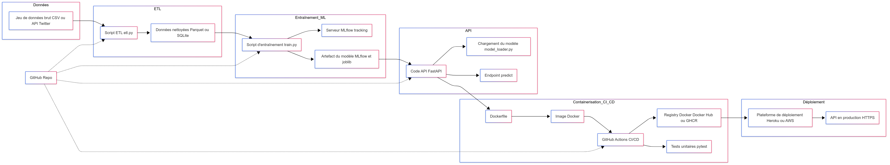

# Sentiment Pipeline

Ce projet met en place un pipeline complet pour l’analyse de sentiment de tweets :
- **ETL** : nettoyage & transformation des données
- **Modélisation ML** : entraînement avec suivi MLflow
- **API FastAPI** : service de prédiction Dockerisé
- **CI/CD** : tests unitaires & build Docker via GitHub Actions
- **Déploiement** : Heroku / AWS

---

## Architecture globale

Ci-dessous, le diagramme (Mermaid) de l’architecture générale :

---

## Structure du dépôt

├── etl.py
├── train.py
├── evaluate.py
├── api/
│ ├── main.py
│ ├── model_loader.py
│ └── requirements.txt
├── Dockerfile
├── docker-compose.yml
├── .github/
│ └── workflows/
│ └── ci-cd.yml
├── docs/
│ └── architecture.png
└── README.md